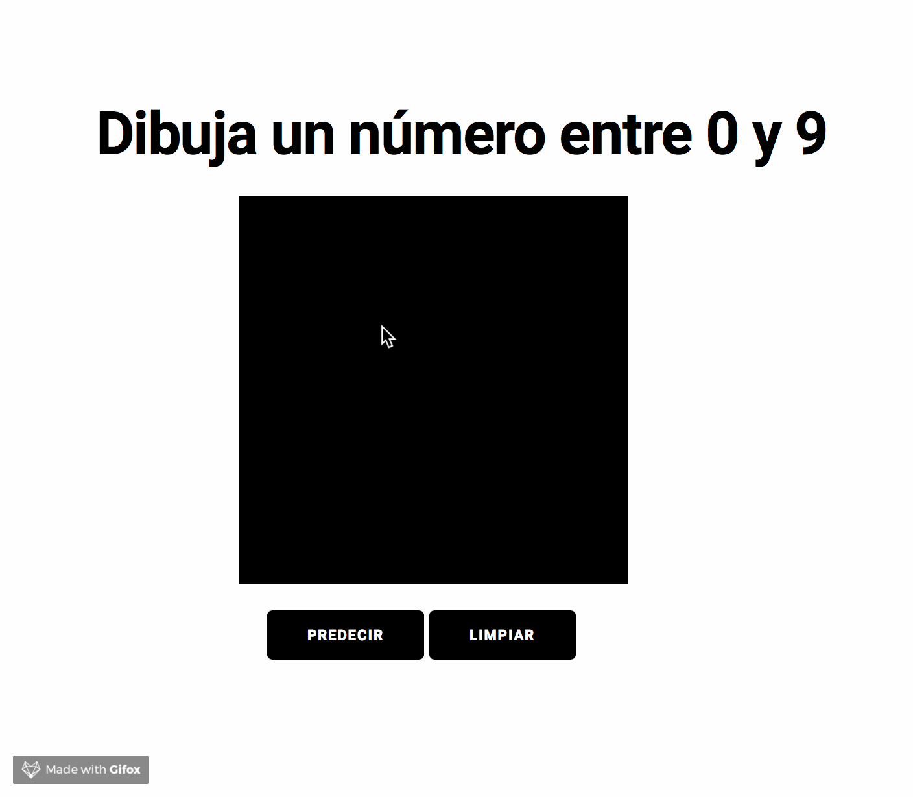

### TensorflowJS demo.

La demo presenta como entrenar un modelo de Keras (Tensorflow como backend) y posteriormente utilizar este modelo con TensorflowJS.

##### Uso de la demo

Instalar las dependencias necesarias mediante el comando:
`pip install -r requirements.txt`
Una vez instaladas las dependencias correr el notebook `train_model.ipynb`

El modelo cuando esté entrenado generará los archivos:
+ `model.json`
+ `group1-shard1of*`

Copiar esos archivos en la carpeta `web`, ir a la carpeta y luego escribir el comando:
`python3 -m http.server 8080`

Ir a `http://localhost:8080` y ver el funcionamiento de la demo.

